# 💰 Money Manager – Expense Tracker App


A modern **Finance Manager / Expense Tracker** built using **React Native (Expo)** and **SQLite** for reliable offline storage.

> Designed with a clean fintech-style UI and powerful budgeting features to help users track and control their expenses.

---

## ✨ Highlights

* 📱 Offline-first expense tracker
* 🎯 Smart budgeting system
* 📊 Beautiful analytics dashboard
* 🌙 Dark & Light theme

---

## 📥 Download APK

👉 [Download Latest APK]
https://expo.dev/accounts/dc31/projects/MoneyManager/builds/8a6062d7-7ecb-45de-8fb6-f26557b73bba
---

## 🚀 Features

### 📊 Dashboard

* Total balance overview
* Monthly income/expense summary
* Weekly analytics chart

### 📈 Insights & Analytics

* Category-wise spending breakdown (Donut chart)
* Monthly / Weekly / Yearly filters
* Net balance calculation

### 💸 Transactions

* Add income & expenses
* Swipe to **delete** or **archive**
* Categorized transaction list

### 🎯 Budget Management

* Set budget per category
* Real-time usage tracking
* ⚠️ Over-budget alerts

### 🎁 Offers & Vouchers

* Curated deals (Food, Shopping, Travel)
* Copy coupon codes instantly

### 👤 Profile

* Edit display name
* Select currency (INR supported)
* Data stored locally (secure & private)

### 🌗 UI/UX

* Dark mode + Light mode
* Smooth animations
* Clean fintech-style UI

---

## 🛠️ Tech Stack

* ⚛️ React Native (Expo)
* 🗄️ SQLite (Local Database)
* 📱 Expo Router
* 🟦 TypeScript

---

## 📦 Setup Instructions

1. Clone the repository:

   ```bash
   git clone https://github.com/devanshchaurasia179/MoneyManage.git
   cd your-repo-name
   ```

2. Install dependencies:

   ```bash
   npm install
   ```

3. Start the app:

   ```bash
   npx expo start
   ```

4. Run on device:

   * Expo Go app
   * Android Emulator

---

## 📸 Screenshots

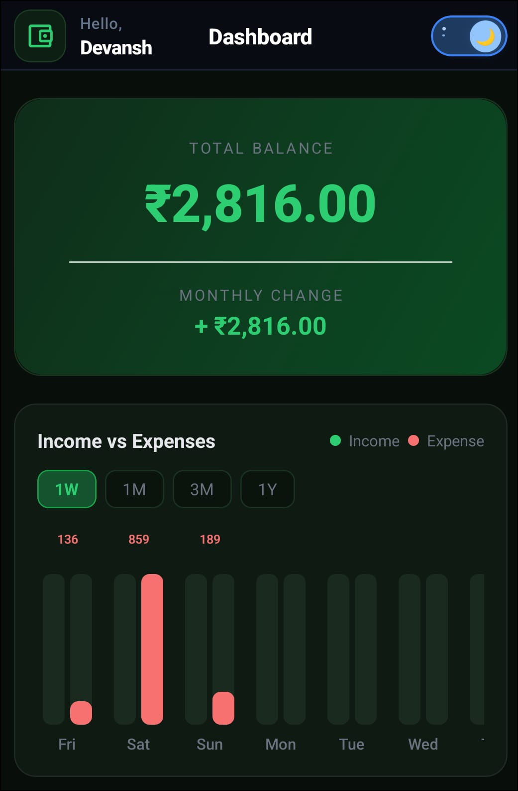
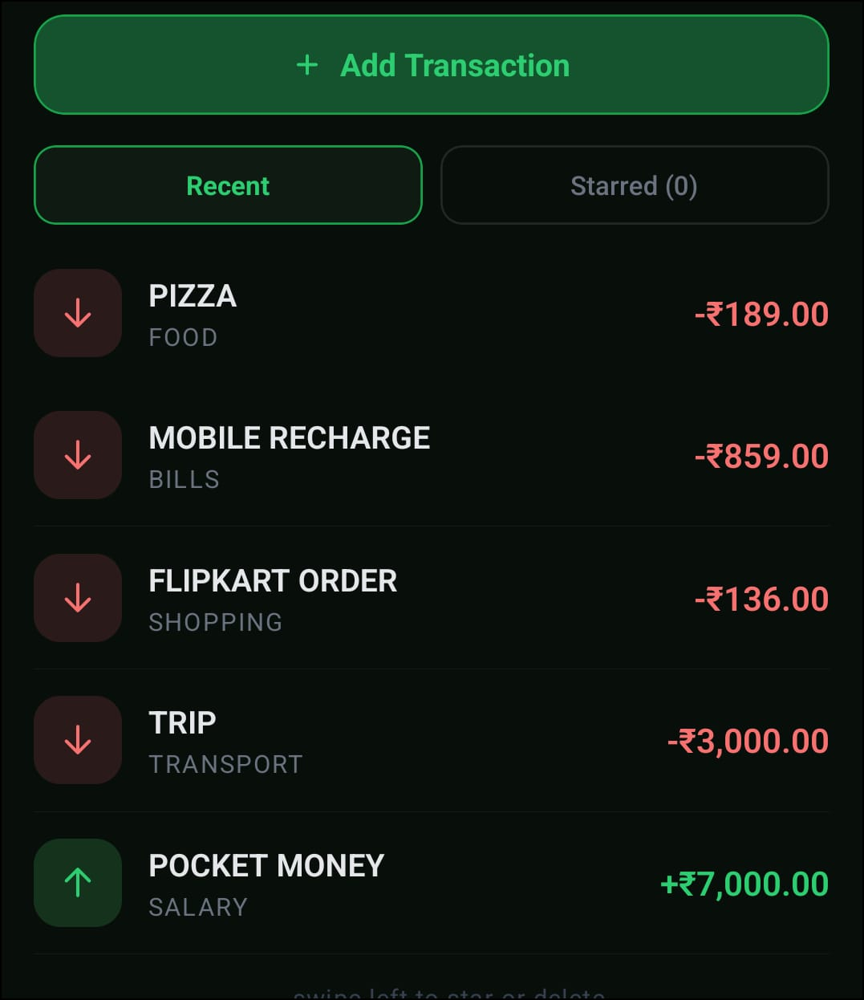
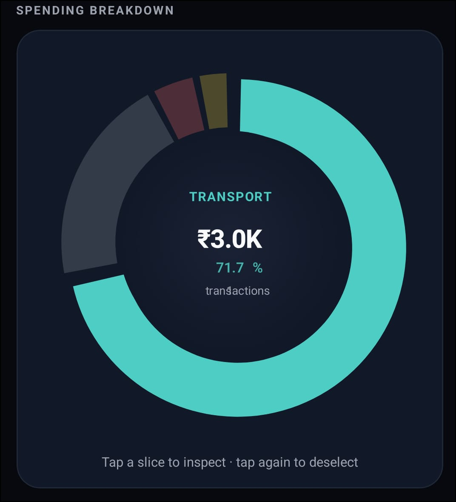
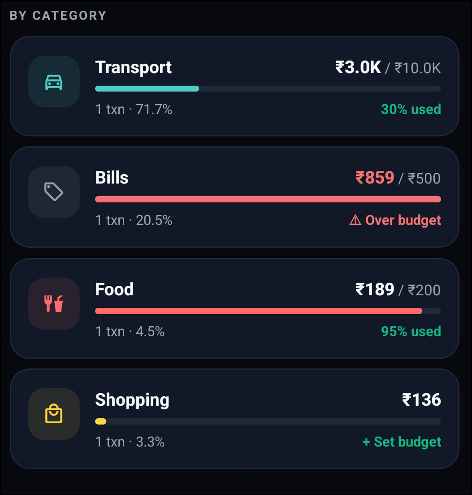
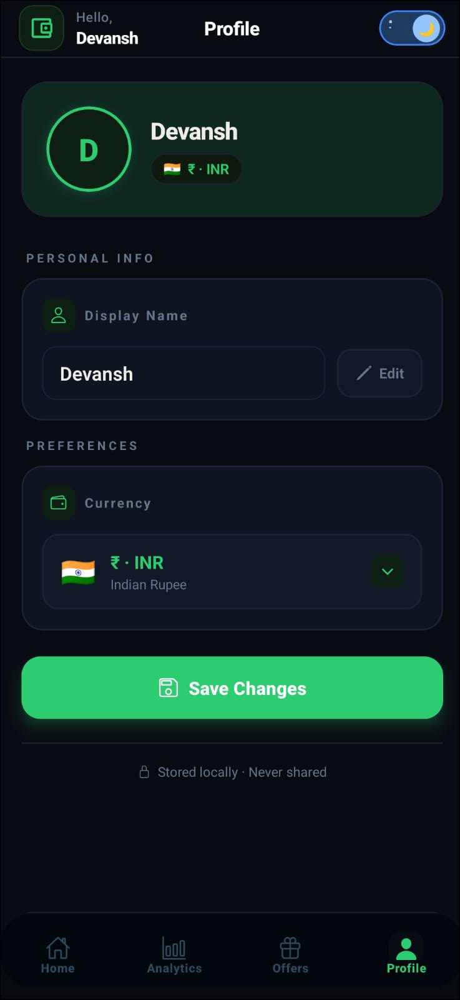
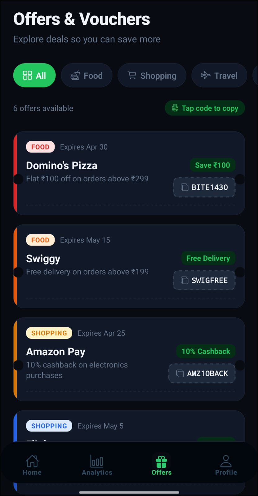
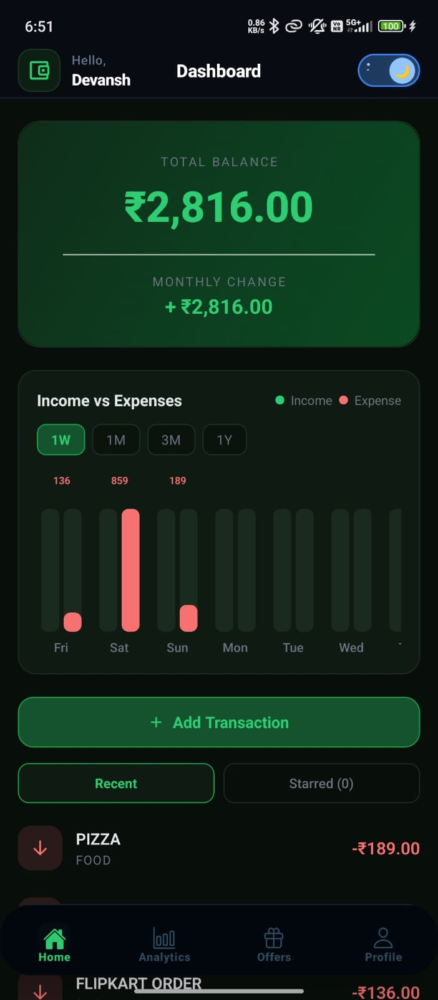
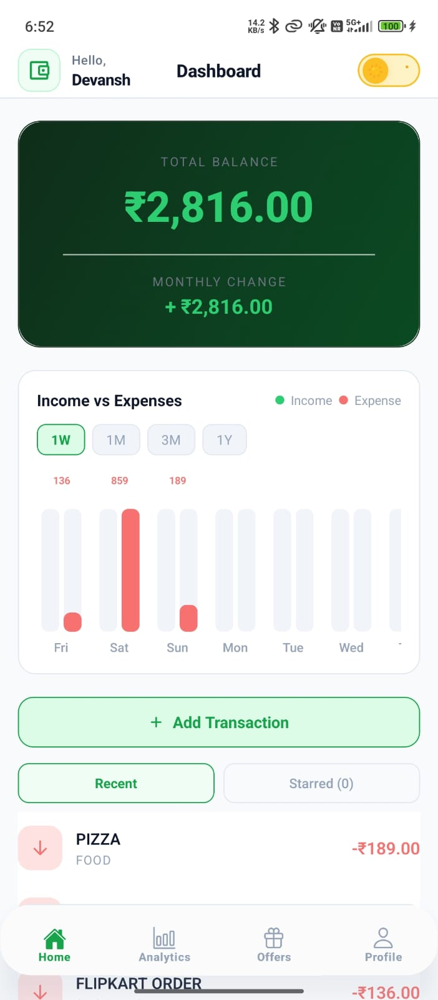
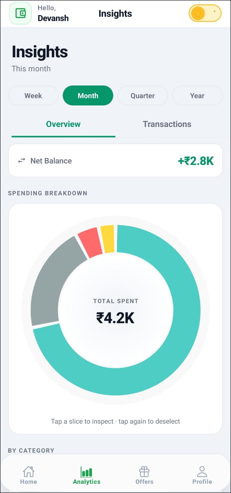
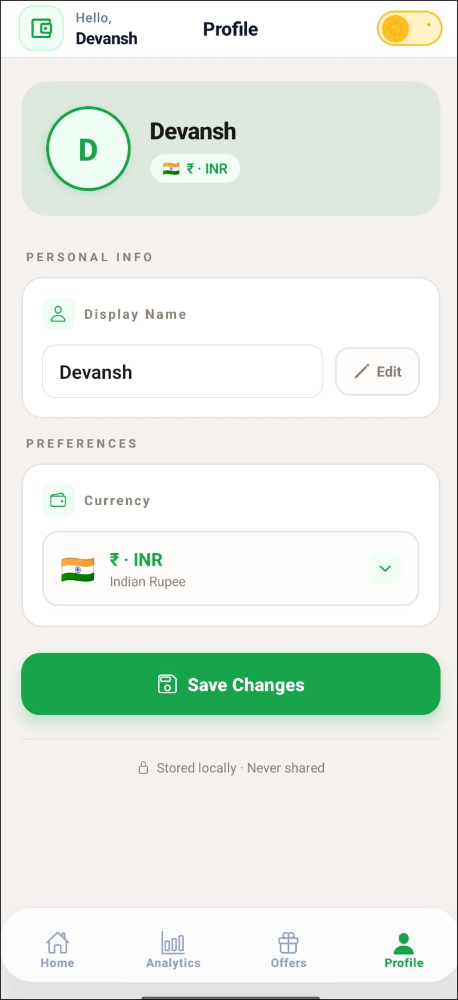
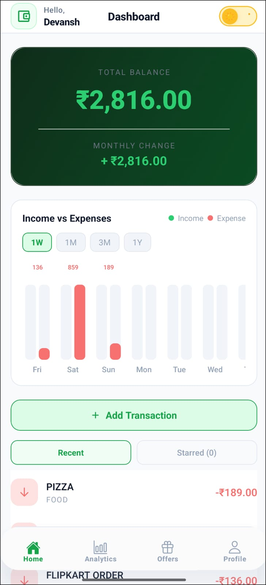

---

## 🧠 Key Highlights

* Offline-first app using SQLite
* Budget system prevents overspending
* Clean fintech UI (Dark + Light mode)
* Interactive analytics & charts
* Swipe gestures for better UX

---

## 💡 Why SQLite?

* Works offline
* Fast & lightweight
* No backend required
* Persistent local storage

---

## 🔮 Future Improvements

* Cloud sync (Firebase / Supabase)
* Authentication system
* Export reports (PDF/CSV)
* Smart notifications

---

## 👨‍💻 Author

**Devansh Kumar**

---

## ⭐ Support

If you like this project, give it a ⭐ on GitHub!
